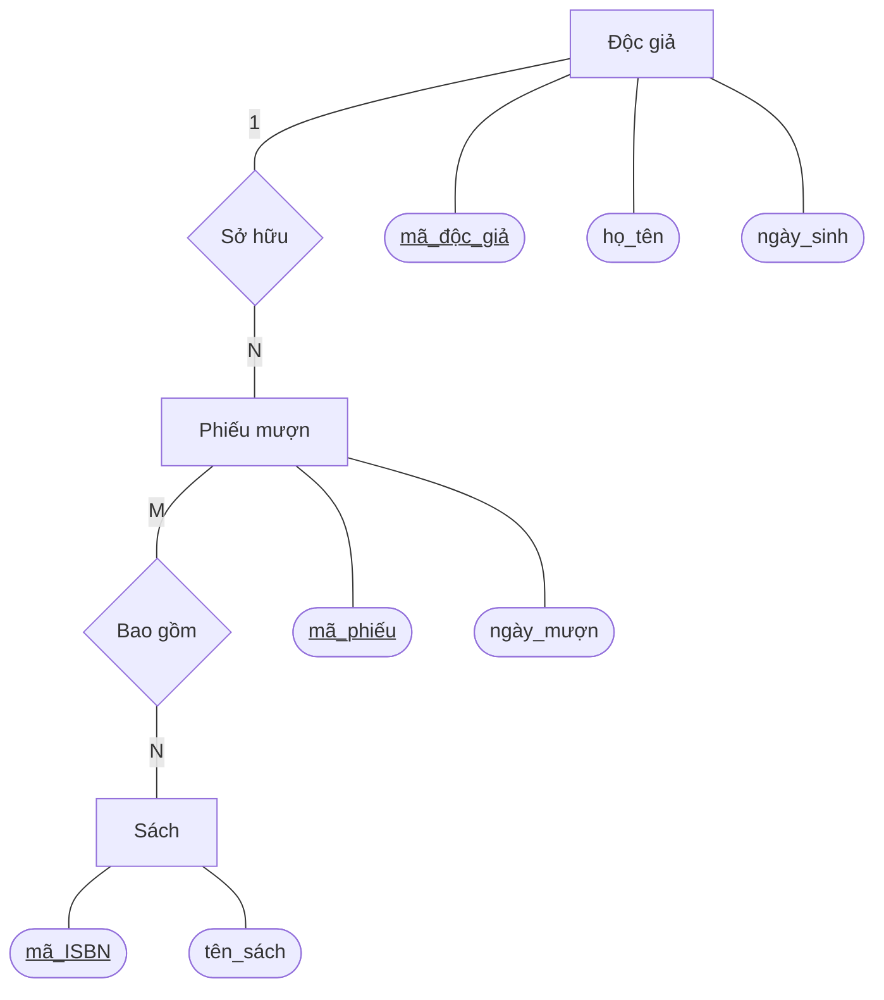

## 1. Phân tích Thực thể và Thuộc tính

Dưới đây là cấu trúc các thực thể, bao gồm việc xác định Khóa chính (PK) và Khóa ngoại (FK).

### 📚 Thực thể: Sách (Books)
| Thuộc tính | Kiểu dữ liệu | Loại khóa | Mô tả |
| :--- | :--- | :---: | :--- |
| **ma_ISBN** | VARCHAR | **PK** | Mã số tiêu chuẩn quốc tế của sách |
| ten_sach | VARCHAR | | Tên cuốn sách |
| tac_gia | VARCHAR | | Tên tác giả |
| nam_xuat_ban | INT | | Năm xuất bản |
| the_loai | VARCHAR | | Thể loại sách |

### 👤 Thực thể: Độc giả (Readers)
| Thuộc tính | Kiểu dữ liệu | Loại khóa | Mô tả |
| :--- | :--- | :---: | :--- |
| **ma_doc_gia**| VARCHAR | **PK** | Mã định danh độc giả |
| ho_ten | VARCHAR | | Họ và tên đầy đủ |
| ngay_sinh | DATE | | Ngày tháng năm sinh |
| dia_chi | VARCHAR | | Địa chỉ liên hệ |
| so_dien_thoai| VARCHAR | | Số điện thoại liên lạc |

### 📝 Thực thể: Phiếu mượn (Borrowing_Slips)
| Thuộc tính | Kiểu dữ liệu | Loại khóa | Mô tả |
| :--- | :--- | :---: | :--- |
| **ma_phieu** | VARCHAR | **PK** | Mã định danh phiếu mượn |
| **ma_doc_gia**| VARCHAR | **FK** | Tham chiếu đến người mượn |
| ngay_muon | DATE | | Ngày thực hiện mượn sách |
| ngay_tra | DATE | | Ngày dự kiến phải trả |
| trang_thai | VARCHAR | | Tình trạng (Đang mượn, Đã trả...) |

---

## 2. Sơ đồ Thực thể - Mối quan hệ (ERD)

Sơ đồ dưới đây thể hiện mối quan hệ giữa các thực thể theo chuẩn Chen Notation:

*(Ghi chú: Sơ đồ đã được rút gọn một số thuộc tính để hiển thị trực quan hơn).*