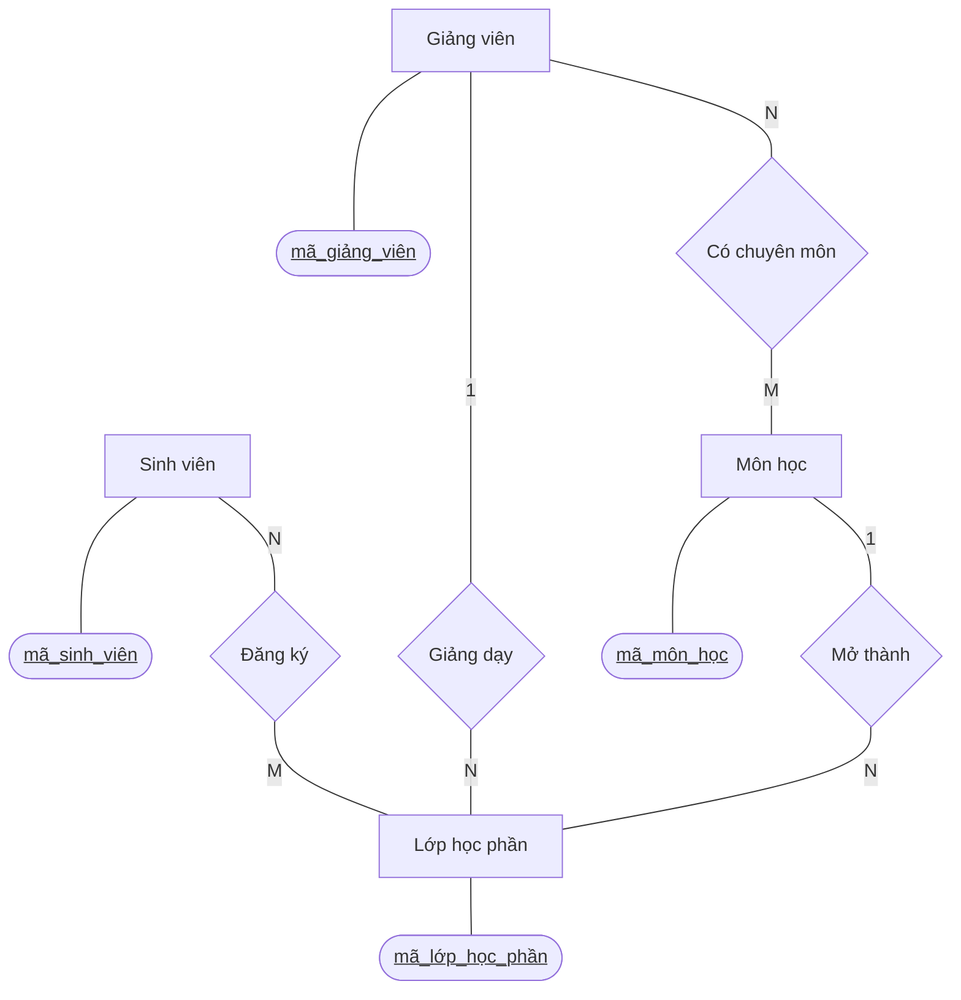

## 1. Xác Định Các Thực Thể Chính
Hệ thống bao gồm 4 nhóm dữ liệu cơ bản (Thực thể):
1. **Sinh viên** (Students)
2. **Môn học** (Subjects / Courses)
3. **Giảng viên** (Instructors)
4. **Lớp học phần** (Course Sections / Classes)

---

## 2. Phân Tích Mối Quan Hệ (Relationships) & Bội Số (Cardinality)

Dưới đây là bảng phân tích cách các thực thể tương tác với nhau trong thực tế vận hành của trường đại học:

| Thực thể A | Thực thể B | Bội số (Cardinality) | Tên quan hệ | Ý nghĩa thực tế |
| :--- | :--- | :---: | :--- | :--- |
| **Môn học** | **Lớp học phần** | **1 - N** | Mở thành | Một Môn học (VD: Cơ sở dữ liệu) có thể được mở thành nhiều Lớp học phần khác nhau trong kỳ (CSDL_01, CSDL_02). Tuy nhiên, mỗi Lớp học phần chỉ thuộc về duy nhất một Môn học. |
| **Giảng viên** | **Lớp học phần** | **1 - N** | Giảng dạy | Một Giảng viên có thể được phân công giảng dạy nhiều Lớp học phần. Ngược lại, một Lớp học phần thường do một Giảng viên phụ trách chính. |
| **Giảng viên**| **Môn học** | **N - M** | Phụ trách chuyên môn | Một Giảng viên có thể có chuyên môn để dạy nhiều Môn học. Đồng thời, một Môn học cũng có thể do nhiều Giảng viên khác nhau trong bộ môn đảm nhận. |
| **Sinh viên** | **Lớp học phần** | **N - M** | Đăng ký / Học | Một Sinh viên có thể đăng ký tham gia nhiều Lớp học phần trong một học kỳ. Một Lớp học phần cũng tiếp nhận nhiều Sinh viên cùng vào học. |

*(Lưu ý: Quan hệ N-M trong thực tế thiết kế cơ sở dữ liệu sẽ được tách ra thành các bảng trung gian, ví dụ như bảng "Đăng ký học" giữa Sinh viên và Lớp học phần).*

---

## 3. Sơ Đồ ERD (Mô Hình Thực Thể - Mối Quan Hệ)

Sơ đồ dưới đây được vẽ theo chuẩn Chen Notation, tập trung thể hiện luồng quan hệ giữa các thực thể và các khóa chính định danh:

