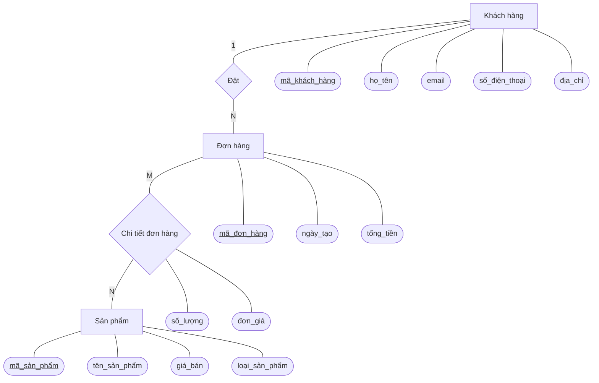

## 1. Xác Định Thực Thể và Thuộc Tính

Hệ thống bao gồm 4 bảng dữ liệu (thực thể) chính. Để đảm bảo tính toàn vẹn dữ liệu, các thuộc tính định danh (mã) đã được bổ sung làm Khóa chính (PK).

### 👤 Thực thể: Khách hàng (Customers)
| Thuộc tính | Loại khóa | Mô tả |
| :--- | :---: | :--- |
| **ma_khach_hang** | **PK** | Mã định danh duy nhất của khách hàng (bổ sung) |
| ho_ten | | Họ và tên khách hàng |
| email | | Địa chỉ thư điện tử |
| so_dien_thoai | | Số điện thoại liên hệ |
| dia_chi | | Địa chỉ giao hàng/liên hệ |

### 📦 Thực thể: Sản phẩm (Products)
| Thuộc tính | Loại khóa | Mô tả |
| :--- | :---: | :--- |
| **ma_san_pham** | **PK** | Mã định danh duy nhất của sản phẩm |
| ten | | Tên sản phẩm điện tử |
| gia | | Giá bán hiện tại |
| loai_san_pham | | Danh mục/Loại sản phẩm (VD: Điện thoại, Laptop...) |

### 🛒 Thực thể: Đơn hàng (Orders)
| Thuộc tính | Loại khóa | Mô tả |
| :--- | :---: | :--- |
| **ma_don_hang** | **PK** | Mã số duy nhất của mỗi đơn hàng |
| **ma_khach_hang** | **FK** | Khóa ngoại tham chiếu đến người đặt hàng |
| ngay_tao | | Ngày và giờ đơn hàng được tạo |
| tong_tien | | Tổng giá trị của đơn hàng |

### 🧾 Thực thể: Chi tiết đơn hàng (Order_Details)
*(Đây là thực thể trung gian giúp giải quyết mối quan hệ Nhiều - Nhiều giữa Đơn hàng và Sản phẩm)*
| Thuộc tính | Loại khóa | Mô tả |
| :--- | :---: | :--- |
| **ma_don_hang** | **PK, FK** | Tham chiếu đến Đơn hàng tương ứng |
| **ma_san_pham** | **PK, FK** | Tham chiếu đến Sản phẩm được mua |
| so_luong | | Số lượng sản phẩm mua trong đơn này |
| don_gia | | Giá của sản phẩm tại thời điểm mua |

---

## 2. Phân Tích Mối Quan Hệ (Kiểu liên kết)

| Thực thể A | Thực thể B | Bội số | Mô tả liên kết |
| :--- | :--- | :---: | :--- |
| **Khách hàng** | **Đơn hàng** | **1 - N** | Một Khách hàng có thể đặt nhiều Đơn hàng khác nhau. Mỗi Đơn hàng chỉ thuộc về một Khách hàng duy nhất. |
| **Đơn hàng** | **Sản phẩm** | **N - M** | Một Đơn hàng có thể bao gồm nhiều Sản phẩm. Một Sản phẩm có thể xuất hiện trong nhiều Đơn hàng khác nhau. |
| **Đơn hàng** | **Chi tiết đơn hàng**| **1 - N** | (Phân rã từ N-M) Một Đơn hàng có nhiều dòng Chi tiết đơn hàng. |
| **Sản phẩm** | **Chi tiết đơn hàng**| **1 - N** | (Phân rã từ N-M) Một Sản phẩm có thể nằm trong nhiều dòng Chi tiết đơn hàng khác nhau. |

---

## 3. Sơ Đồ Thực Thể - Mối Quan Hệ (ERD)

Sơ đồ dưới đây được vẽ theo chuẩn Chen Notation. Lưu ý: Thực thể "Chi tiết đơn hàng" được thể hiện trực tiếp thông qua mối quan hệ (hình thoi) có chứa thuộc tính riêng.

