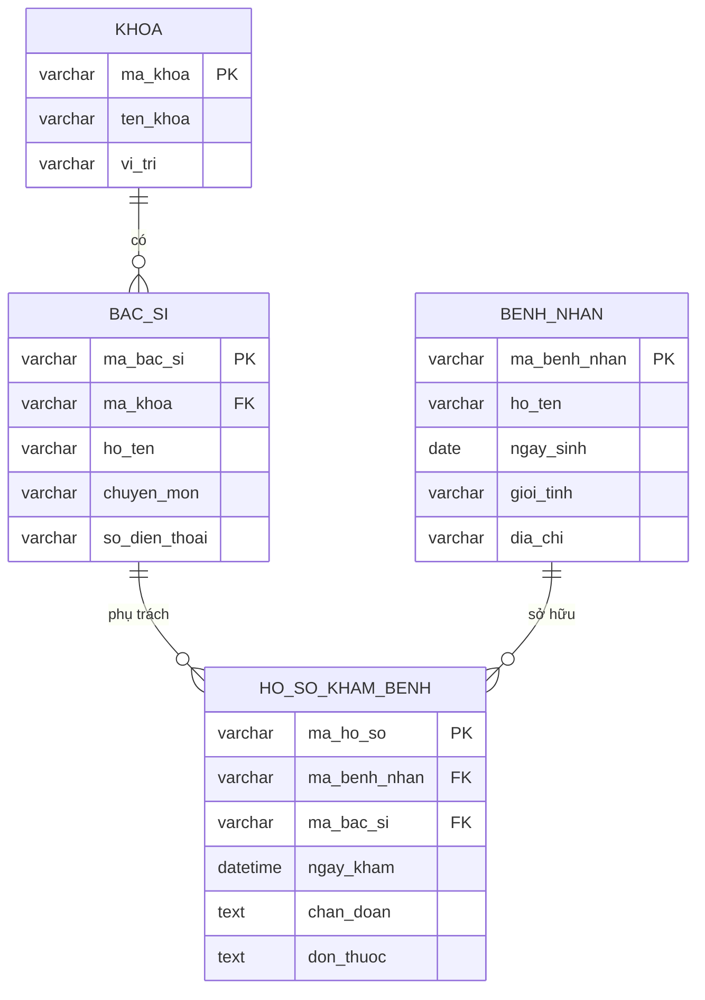

## 1. Danh Sách Các Bảng Quan Hệ (Tables) & Thuộc Tính

Dưới đây là cấu trúc của 4 bảng dữ liệu chính. Các thuộc tính định danh đã được thiết lập thành **Khóa chính (PK)**.

### 🏥 Bảng: Khoa (Departments)
| Thuộc tính | Loại khóa | Kiểu dữ liệu (Gợi ý) | Mô tả |
| :--- | :---: | :--- | :--- |
| **ma_khoa** | **PK** | VARCHAR | Mã định danh duy nhất của khoa |
| ten_khoa | | VARCHAR | Tên khoa (VD: Nội tim mạch, Ngoại thần kinh) |
| vi_tri | | VARCHAR | Vị trí phòng ban / tòa nhà |

### 👨‍⚕️ Bảng: Bác sĩ (Doctors)
| Thuộc tính | Loại khóa | Kiểu dữ liệu (Gợi ý) | Mô tả |
| :--- | :---: | :--- | :--- |
| **ma_bac_si** | **PK** | VARCHAR | Mã định danh duy nhất của bác sĩ |
| **ma_khoa** | **FK** | VARCHAR | Tham chiếu đến bảng `Khoa` |
| ho_ten | | VARCHAR | Họ và tên bác sĩ |
| chuyen_mon | | VARCHAR | Chuyên khoa sâu của bác sĩ |
| so_dien_thoai| | VARCHAR | Số điện thoại liên hệ |

### 🤒 Bảng: Bệnh nhân (Patients)
| Thuộc tính | Loại khóa | Kiểu dữ liệu (Gợi ý) | Mô tả |
| :--- | :---: | :--- | :--- |
| **ma_benh_nhan**| **PK** | VARCHAR | Mã định danh duy nhất của bệnh nhân |
| ho_ten | | VARCHAR | Họ và tên bệnh nhân |
| ngay_sinh | | DATE | Ngày tháng năm sinh |
| gioi_tinh | | VARCHAR | Giới tính (Nam/Nữ) |
| dia_chi | | VARCHAR | Địa chỉ liên lạc |

### 📋 Bảng: Hồ sơ khám bệnh (Medical_Records)
| Thuộc tính | Loại khóa | Kiểu dữ liệu (Gợi ý) | Mô tả |
| :--- | :---: | :--- | :--- |
| **ma_ho_so** | **PK** | VARCHAR | Mã định danh duy nhất của lượt khám |
| **ma_benh_nhan**| **FK** | VARCHAR | Tham chiếu đến bảng `Bệnh nhân` |
| **ma_bac_si** | **FK** | VARCHAR | Tham chiếu đến bảng `Bác sĩ` |
| ngay_kham | | DATETIME | Ngày giờ thực hiện khám bệnh |
| chan_doan | | TEXT | Chẩn đoán bệnh lý của bác sĩ |
| don_thuoc | | TEXT | Chỉ định điều trị / Đơn thuốc |

---

## 2. Xử Lý Các Mối Quan Hệ (Relationships)

Việc chuyển đổi từ ERD sang Bảng quan hệ tuân thủ các quy tắc ép kiểu sau:

* **Quan hệ 1-N (Khoa - Bác sĩ):** * *Nguyên tắc:* Khóa chính của bảng "1" trở thành Khóa ngoại của bảng "N".
  * *Áp dụng:* Thêm `ma_khoa` vào bảng **Bác sĩ** để xác định bác sĩ đó thuộc khoa nào.

* **Quan hệ N-N (Bác sĩ - Bệnh nhân):**
  * *Nguyên tắc:* Tạo một bảng trung gian, sử dụng khóa chính của 2 bảng ban đầu làm khóa ngoại.
  * *Áp dụng:* Mối quan hệ khám bệnh giữa Bác sĩ và Bệnh nhân được chuyển hóa thành bảng **Hồ sơ khám bệnh**. Bảng này chứa cả `ma_bac_si` và `ma_benh_nhan` để lưu trữ lịch sử tương tác giữa hai đối tượng này theo từng mốc thời gian.

---

## 3. Sơ Đồ Cơ Sở Dữ Liệu Quan Hệ (Relational Schema)

Sơ đồ dưới đây thể hiện trực tiếp các bảng và đường liên kết Khóa ngoại (Foreign Key) theo chuẩn thiết kế CSDL thực tế:

